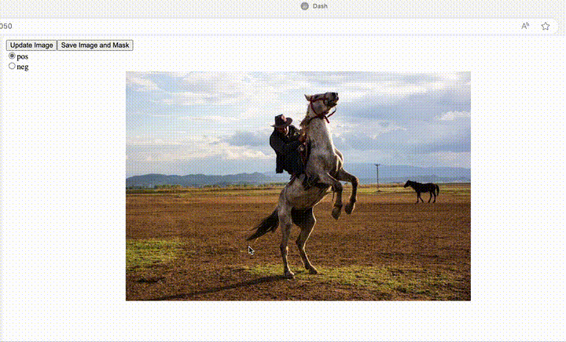
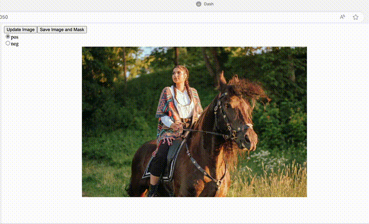

[README ENGLISH](README_en.md)

# introduction


링크에서 box, point를 간단히 plotly dash로 구현한 것
[sam2 notebook link](https://github.com/facebookresearch/segment-anything-2/blob/main/notebooks/image_predictor_example.ipynb)


```python
# Combining points and boxes
Points and boxes may be combined, just by including both types of prompts to the predictor. Here this can be used to select just the trucks's tire, instead of the entire wheel.

input_box = np.array([425, 600, 700, 875])
input_point = np.array([[575, 750]])
input_label = np.array([0])
masks, scores, logits = predictor.predict(
    point_coords=input_point,
    point_labels=input_label,
    box=input_box,
    multimask_output=False,
)
```
radio button에서 postive point를 선택한 상태로 이미지를 클릭하면 positive point가 찍히는 방식 


## advanced

매번 radio button을 누르기 귀찮기 때문에 bbox로 통일함

사람은 일반적으로 박스를 왼쪽 위에서 오른쪽 아래로 그림

나머지 3가지 방식은
- 오른쪽 위에서 왼쪽 아래로
- 왼쪽 아래에서 오른쪽 위
- 오른쪽 아래에서 왼쪽 위

여기서

- 왼쪽 아래 오른쪽 위로 그릴 경우, 시작점(왼쪽 아래)에 positive point를 생성하게 변경
- 오른쪽 아래 왼쪽 위로 그릴 경우, 시작점(오른쪽 아래) negative point를 생성하게 변경





## 설치


justfile 사용시
```bash
just install
```

그냥 설치시,
```bash
conda env list | grep  $PWD/venv || conda create -y --prefix $PWD/venv python=3.11 pip ipykernel
conda activate $PWD/venv

pip install -U -r requirements.txt
test -d segment-anything-2 || git clone https://github.com/facebookresearch/segment-anything-2.git
cd segment-anything-2
pip install -e ".[demo]"

mkdir -p checkpoints
test -f checkpoints/sam2_hiera_tiny.pt || wget --directory-prefix checkpoints/ https://dl.fbaipublicfiles.com/segment_anything_2/072824/sam2_hiera_tiny.pt 
```

##  실행
```bash
conda activate venv/
python bbox-app.py
```

## todo:
- multi object 가능하게 변경