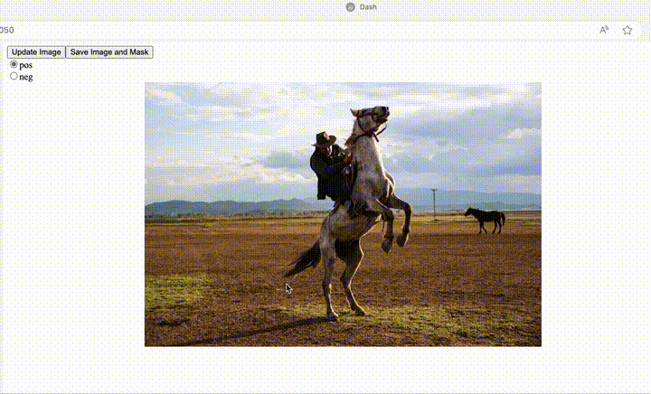

# Introduction


This is a simple implementation of box and point plotting using Plotly Dash.
[sam2 notebook link](https://github.com/facebookresearch/segment-anything-2/blob/main/notebooks/image_predictor_example.ipynb)

```python
# Combining points and boxes
Points and boxes may be combined by including both types of prompts to the predictor. Here this can be used to select just the truck's tire, instead of the entire wheel.

input_box = np.array([425, 600, 700, 875])
input_point = np.array([[575, 750]])
input_label = np.array([0])
masks, scores, logits = predictor.predict(
    point_coords=input_point,
    point_labels=input_label,
    box=input_box,
    multimask_output=False,
)
```

When the radio button is set to positive point, clicking on the image will mark a positive point.


## Advanced
To avoid the hassle of clicking the radio button every time, I have unified it with bbox.

People generally draw boxes from the top-left to the bottom-right.

The other three methods are:
- From top-right to bottom-left
- From bottom-left to top-right
- From bottom-right to top-left

Here,

- When drawing from bottom-left to top-right, a positive point is created at the starting point (bottom-left).
- When drawing from bottom-right to top-left, a negative point is created at the starting point (bottom-right).


## Installation

Using justfile:

```bash
just install
```

If installing manually:

```bash
conda env list | grep  $PWD/venv || conda create -y --prefix $PWD/venv python=3.11 pip ipykernel
conda activate $PWD/venv

pip install -U -r requirements.txt
test -d segment-anything-2 || git clone https://github.com/facebookresearch/segment-anything-2.git
cd segment-anything-2
pip install -e ".[demo]"

mkdir -p checkpoints
test -f checkpoints/sam2_hiera_tiny.pt || wget --directory-prefix checkpoints/ https://dl.fbaipublicfiles.com/segment_anything_2/072824/sam2_hiera_tiny.pt 
```


## Run demo

```bash
conda activate venv/
python bbox-app.py
```

## Todo
- Modify to support multiple objects